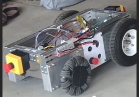
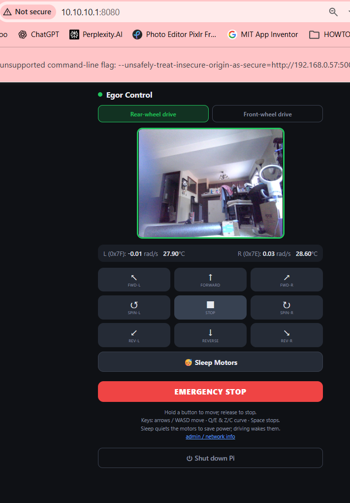
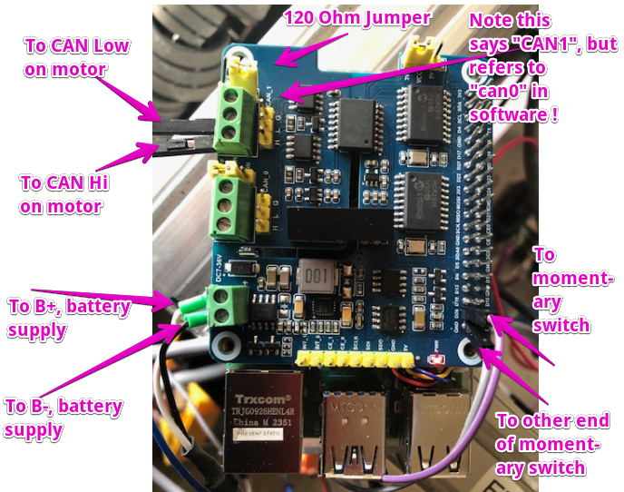
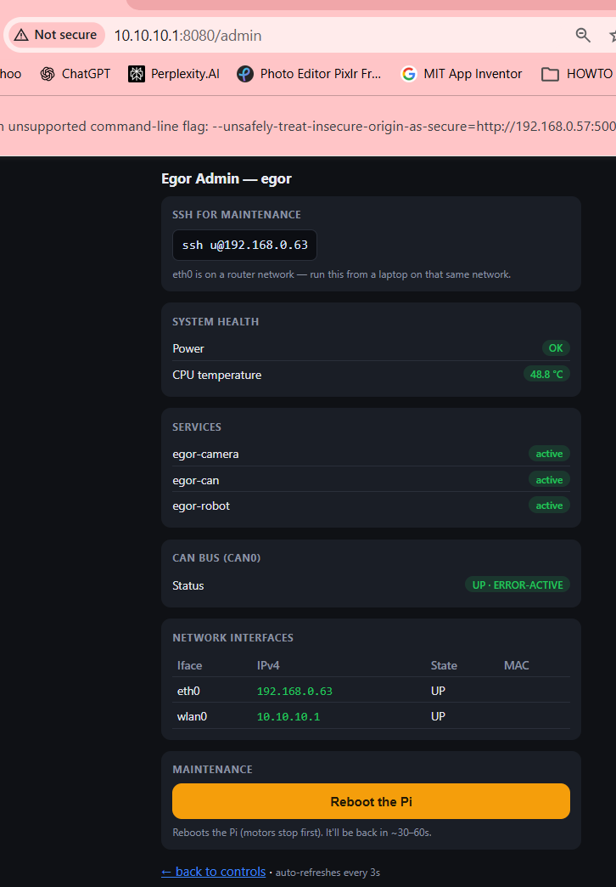

# EgorRobot — Master Guide & Project Context

**NOTE:** This document (`CLAUDE.md` is the single source of truth for this project.  A human *or* AI session should be able to work on the project from this file alone — `README.md` just points here.

---

## Introduction
Revive and control a small Raspberry Pi 5 robot chassis with two wheels driven
by Xiaomi CyberGear smart motors over a CAN bus. The robot previously worked; this effort brought it back to life after re-wiring and gave it a web-page control over private wifi access point.




**Status:** Working. Motors drive under command (speed & position), direction-
corrected, untethered; the robot is drivable from a web joystick page with live
webcam video, a rear/front-wheel drive toggle, and an admin/health page. The Pi5 is
healthy — a Sept-2026 "won't boot" scare was diagnosed (via boot breadcrumbs) to a
networking/IP issue, not hardware. The portable egorwifi access point
(`10.10.10.1`) + two-QR sticker access is built and working; captive-portal
auto-open was attempted but is blocked by modern phone DNS/HTTPS behavior (use the
QR). As of September 2026.

**Video/Demo**  
https://www.youtube.com/shorts/Zz-gmUw6PC0

## Features at a glance

Beyond basic driving, this has the following features, split out based on whether the feature is geared for a user or for an admin.

### For the person using the robot
- **Web joystick control** [done] — a phone-friendly page (hold-to-move, release-
  to-stop, keyboard keys, a big EMERGENCY STOP) that drives the robot over Wi-Fi.
- **Live camera view** [done] — the robot's USB webcam streamed into that page, so
  the driver sees where it's going.
- **Rear / front-wheel drive toggle** [done] — a one-tap switch that flips the
  robot's sense of "forward" 180°, so whichever end is leading becomes the front and
  you can drive it from either side without walking around it (both forward/back AND
  driver/passenger swap). The camera border makes the current mode obvious at a
  glance — **green in rear-wheel mode, red in front-wheel mode**.
- **Sleep / Wake motors** [done] — a one-tap toggle that disables the motors so they
  go **quiet** when the robot is just sitting idle (they hum while holding position),
  then wakes them; any drive command also wakes them automatically. Distinct from the
  emergency stop — this is a benign power/quiet switch, not a safety latch.
- **One-tap safe shutdown** [done] — a confirm-guarded button that powers the Pi
  down cleanly from the page.
- **Scan-and-go access** [done] — the Pi hosts its own Wi-Fi (`egorwifi`,
  `10.10.10.1`) so the robot works anywhere with no router; a printable **two-QR
  sticker** joins the network (password embedded, nothing to type) and opens the
  controls. Scan to join, scan to drive. (Captive-portal *auto*-open was attempted
  but modern phones block it — see Access layer; the two-QR flow is the method.)

### For admins / developers / troubleshooting
The "make it maintainable" extras — several are generic enough to reuse on any
Raspberry Pi project.
- **Admin / health page** (`/admin`) [done] — one-glance panel: each interface's IP
  (with a ready-to-copy `ssh u@<eth0-ip>` for maintenance), power/under-voltage
  status, CPU temperature, the three services' health, the CAN bus state, and a
  **Reboot** button.
- **Web shutdown & reboot** [done] — power off or restart from the browser, gated by
  a narrow, validated password-less-sudo rule for only `shutdown`.
- **Hardware emergency shutdown button** [done] — a physical GPIO push-button that
  forces a clean shutdown, protecting the SD card from power-bump corruption.
- **Boot breadcrumbs** (`bootcrumbs.sh`) [done] — stamps how far a boot got (and its
  IP + board model) onto the card at each stage, to diagnose a Pi that won't boot or
  isn't reachable **without HDMI or serial**. This is what proved the Pi5 was fine.
  Reusable on any Pi.
- **Direct-cable SSH** (`setup_eth_direct.sh`) [done] — turns the wired port into a
  self-contained link so a laptop plugged straight in (no router) gets an address
  and can SSH in — field maintenance anywhere.
- **CAN health check** (`check_can.sh`) [done] — read-only "is the motor bus
  healthy?" one-liner.
- **Resilient control server** [done] — starts and serves the UI/admin even with no
  CAN HAT (reports the fault instead of crashing); a watchdog stops the wheels if
  commands stop arriving.
- **Boot-persistent services** [done] — CAN bring-up, control server, and camera
  each auto-start at boot via their own installer scripts.
- **Low-level API test clients** (`run_*.py`) and an **emergency `estop.sh`** [done]
  for quick shell bring-up and a hard stop.

---

## Quickstart

This section is a fast path if you already know or are familiar with Pi + CAN motor projects and have the hardware. Assumes Raspberry Pi OS 64-bit **Lite**, the Waveshare 2-CH CAN HAT, CAN-compatible motors, 
and the repo at `~/gitprojects/egorrobot`. 

**NOTE/Warning!** The one trap
that will waste your afternoon: the Pi hat header silk-screened **"CAN1" is Linux
`can0`** — the motors live on `can0`.
1. Attach the Waveshare CAN HAT to the Pi.
1. Jump the CAN HAT's 120 Ohm jumper to ON.
1. Install Raspi OS using the Raspi Imager.

1. **CAN HAT overlays** — append to `/boot/firmware/config.txt`, then reboot:
   ```
   dtparam=spi=on
   dtoverlay=spi1-3cs
   dtoverlay=mcp2515,spi1-1,oscillator=16000000,interrupt=22
   dtoverlay=mcp2515,spi1-2,oscillator=16000000,interrupt=13
   ```
2. **Dependencies:**
   ```
   sudo apt update && sudo apt install -y \
     can-utils python3-can python3-pip python3-flask ustreamer v4l-utils
   ```
3. **Bus bring-up + smoke test** (motors on `can0` @ **1 Mbit/s**):
   ```
   sudo ./utils/setup_can_service.sh     # can0 up @1M on every boot (egor-can)
   python3 utils/scan_motors.py          # expect motors 0x7E and 0x7F
   python3 utils/dance_test.py           # both wheels: fwd/back demo
   ```
4. **Install the services** (each auto-starts on boot, in order):
   ```
   sudo ./utils/setup_robot_service.sh   # web control  :8080  (egor-robot)
   sudo ./utils/setup_camera_service.sh  # webcam MJPEG  :8081  (egor-camera)
   sudo ./utils/setup_shutdown_api.sh    # sudo rule for web shutdown/reboot
   ```
   Drive it at `http://egor:8080/` — hold-to-move, WASD/arrows, EMERGENCY STOP, and
   the RWD/FWD toggle (camera border green = rear, red = front).
5. **Portable AP (optional):** `sudo ./utils/setup_ap.sh && sudo reboot` → SSID
   **`egorwifi`** / pw **`password`**, robot at `http://10.10.10.1:8080`. Printable
   access sticker: `pip install "qrcode[pil]" && python3 utils/make_qr.py`.

Everything below is the same in full detail, plus the
CyberGear protocol, wiring, and diagnostic info.

---


## Hardware

- **Raspberry Pi 5**, hostname `egor`. OS: Raspberry Pi OS 64-bit **Lite**.
- **Waveshare 2-CH CAN HAT** (MCP2515 controller + CAN transceiver per channel).  Set the 120 Ohm resistor jumper to ON.  
  
- **2 × Xiaomi CyberGear micromotors** (model MIQDD-PG-06-12-02A), **7.75:1**
  integrated planetary gearbox. Feedback is **load-end (post-gearbox)**, so one
  reported "rotation" = one wheel turn.
- Both motors are **daisy-chained on a single CAN bus** (one CAN cable).
- **One power supply (~20 V; CyberGear spec 16–28 V)** feeds BOTH the Pi/hat and
  the motor rail. The motor rail passes through a main switch, a side red switch,
  and **front/back bump (e-stop) switches** that cut the **motor rail only** —
  the Pi stays powered when a bump switch trips.

## Access

```
ssh u@egor          # user "u", host "egor"
```
Repo lives at `~/gitprojects/egorrobot` on the Pi (files are edited on a separate
dev machine and copied over — changes do not auto-deploy). A backup OS image
(`egor_9_7_with_powerdown.img`) is saved in the repo root in case the SD card fails.

---

## ⚠️ CRITICAL GOTCHAS (these cost the most time — read them)

### 1. The Waveshare header labels are SWAPPED vs the Linux interface names
The header physically silk-screened **"CAN1"** enumerates as the **`can0`**
interface in Linux. **The motors are wired to that header, so in software they
are on `can0`.** The `can1` interface exists but has **no cable** and is unused.
> Rule: ignore the board silkscreen. **Use `can0` for everything motor-related.**
> Trust the empirical result (which interface returns a reply), not the label.

### 2. The CAN interface must be up at 1 Mbit/s before talking to motors
A systemd service brings `can0` up automatically on every boot. Install it once:
```
sudo ./utils/setup_can_service.sh    # installs & starts egor-can.service
```
If you need it manually (or before installing the service):
```
sudo ip link set can0 up type can bitrate 1000000
```
CyberGear runs at **1 Mbit/s**. Note: python-can's `bitrate=` argument is
**ignored** for SocketCAN — the real bitrate comes from `ip link` / the service.

### 3. A latched bump/e-stop switch silently kills the motor rail
Symptom during revival: motor got **0 V** while the Pi ran fine. Cause: the
front bump switch (normally-closed e-stop) was **stuck open**. Reset it to
restore power. To locate an open switch in the chain: measure **across each
switch** — the open one drops the full ~20 V; a closed one reads ~0 V.

---

## First-time setup

The detailed version of the Quickstart, for anyone not already fluent in this kind
of build. Do these once on a fresh SD card.
### 0. Attach the Waveshare CAN hat to the Pi
And set the CAN hat's 120 Ohm jumper to the ON position.

### 1. Flash the OS

1. Flash **Raspberry Pi OS 64-bit Lite**.
2. Add the following to the **end** of `/boot/firmware/config.txt` (edit as sudo):
   ```
   dtparam=spi=on
   dtoverlay=spi1-3cs
   dtoverlay=mcp2515,spi1-1,oscillator=16000000,interrupt=22
   dtoverlay=mcp2515,spi1-2,oscillator=16000000,interrupt=13
   ```
3. Save and reboot.
4. After reboot, confirm both interfaces exist:
   ```
   ls /sys/class/net
   ```
   You should see `can0` and `can1` in the output.

> If you re-flash and CAN won't communicate, note that the running system
> reports its CAN clock as 8 MHz; verify the `oscillator=` value matches your
> hat's actual crystal.

### 2. Install CAN tooling (and the rest of the deps)

```
sudo apt update && sudo apt install -y can-utils python3-can python3-pip
```
(The saved image `egor_9_7_with_powerdown.img` already has these installed.) You'll
also want `python3-flask` (web control), `ustreamer` + `v4l-utils` (webcam), and
`qrcode[pil]` via pip (QR sticker) — installed in their sections below, or all at
once per the Quickstart.

### 3. Bring up the motor bus (`can0`)

The motors are on `can0` at **1 Mbit/s**.

**Recommended — install the auto-start service (one time).** So `can0` comes up
at the right bitrate on every boot and you never type the manual command again:
```
sudo ./utils/setup_can_service.sh
```
This installs and starts a systemd service (`egor-can.service`). Manage it with:
```
sudo systemctl status  egor-can.service
sudo systemctl restart egor-can.service
```

**Manual alternative (one-off, not persistent).** Bring it up just for this session:
```
sudo ip link set can0 up type can bitrate 1000000
```
Confirm it is healthy:
```
ip -details link show can0
```
Look for `state UP` and `can state ERROR-ACTIVE`. (`ERROR-PASSIVE` or `BUS-OFF`
means nothing is acknowledging on the bus — check motor power and wiring.)

### 4. Loopback self-test (optional, no motor needed)

Verifies the hat's CAN controller by looping frames back internally.

Enable loopback:
```
sudo ip link set can0 down
sudo ip link set can0 type can bitrate 1000000 loopback on
sudo ip link set can0 up
```
In terminal 1: `candump can0`. In terminal 2: `cansend can0 0300007F#0000000000000000`.
You should see the frame appear in terminal 1. Turn loopback back off when done:
```
# Ctrl-C the candump in terminal 1 first
sudo ip link set can0 down
sudo ip link set can0 type can bitrate 1000000 loopback off
sudo ip link set can0 up
```

### 5. Failsafe power-down button (optional but recommended)

A momentary button that triggers a clean shutdown, protecting the SD card from
corruption on an accidental power bump.

1. Connect a momentary switch between **GPIO26 (BCM) / physical pin 37** and GND.
2. Copy `utils/shutdown_button.py` to `/home/u/`.
3. Create the service file `/etc/systemd/system/shutdown-button.service`:
   ```
   [Unit]
   Description=GPIO Emergency Shutdown Button
   After=multi-user.target

   [Service]
   Type=simple
   # Run as root so GPIO access works correctly.
   User=root
   WorkingDirectory=/home/u
   ExecStart=/usr/bin/python3 /home/u/shutdown_button.py
   # Restart the program if it unexpectedly stops.
   Restart=on-failure
   RestartSec=2

   [Install]
   WantedBy=multi-user.target
   ```
4. Register, enable, and start it:
   ```
   sudo systemctl daemon-reload
   sudo systemctl enable shutdown-button.service
   sudo systemctl start shutdown-button.service
   sudo systemctl status shutdown-button.service
   ```
   View its log with: `sudo journalctl -u shutdown-button.service`

### 6. Test the motors

With `can0` up (step 3) and the **wheels off the ground**:
```
python3 utils/scan_motors.py    # discover motor CAN IDs (finds 0x7E and 0x7F)
python3 utils/motor_test.py     # enable/read/disable one motor (is it alive?)
python3 utils/spin_test.py      # gently spin one motor in speed mode
python3 utils/dance_test.py     # full demo: both wheels, forward/back, N turns
```
Every script disables the motors on exit. Ctrl-C is safe; a bump switch cuts the
motor rail (Pi stays up) for a hard stop.

---

## Motors: IDs, direction, gearbox

Two motors on the one `can0` bus, so they have **distinct CAN IDs**:

| Wheel      | CAN ID       | "Forward" command sign | Notes                         |
|------------|--------------|------------------------|-------------------------------|
| driver     | `0x7F` (127) | **−1**                 | spins backward on a raw `+`   |
| passenger  | `0x7E` (126) | **+1**                 | spins forward on a raw `+`    |

The motors are mounted **mirror-image** on opposite sides, so the same positive
speed command turns them in **opposite physical directions**. Code applies a
per-motor "forward sign" so "forward" means the same physical direction for both.

"5 rotations" is counted from each motor's own feedback angle (post-gearbox), so
it is 5 **wheel** turns regardless of the 7.75:1 gearing.

---

## Web control layer


The robot is drivable over HTTP. `robot_server.py` (Flask, in the repo root) runs a
background control thread that owns the CAN bus and streams speed commands to both
wheels at 50 Hz; Flask request handlers only update shared target state (never touch
the bus). `robot_ui.html` (the joystick page) and `admin.html` must sit alongside it
(the server loads them relative to its own file), so all three live in the repo root.

**Install & run** (recommended: as the auto-start service):
```
sudo apt install -y python3-flask
sudo ./utils/setup_robot_service.sh        # egor-robot.service, starts after egor-can
```
Then open the control page from any device on the same LAN:
```
http://egor:8080/          (or http://<pi-ip>:8080/)
```
Hold a direction to move, release to stop; arrow keys / WASD also work; there's a
big EMERGENCY STOP. **Wheels off the ground until you're sure.**

**Development loop:**
```
./utils/stop_robot_service.sh              # stop the service (also disables motors)
python3 robot_server.py                    # run manually to iterate (from repo root)
sudo systemctl start egor-robot.service    # hand back to the service when done
```

How it works:

- **Primitive:** everything builds on `set_velocity(left, right)`, each in −1..1
  (physical forward). Named button commands are thin wrappers (see `MOVES`).
- **Drive mode (rear / front):** a server-side `drive_mode` flag (`"rear"` by
  default) reinterprets every command. In `"front"` mode `set_velocity` negates
  BOTH wheels — a clean 180° reorientation — so forward/back AND driver/passenger
  both flip, letting you drive the robot from either end. Set via `POST
  /api/mode/<rear|front>`; the current mode is reported in `/api/status`
  (`drive_mode`). The UI's radio buttons call it and tint the camera border
  green (rear) / red (front).
- **Watchdog:** if no command arrives within 0.5 s the wheels are commanded to 0,
  so a dropped connection / closed tab fails safe. The UI resends the held command
  every 150 ms and sends STOP on release.
- **Wheels:** driver `0x7F` = LEFT, passenger `0x7E` = RIGHT.
- **Resilience:** CAN send errors (e.g. a dropped wire → ENOBUFS / no-ACK) are
  caught; the control thread keeps running and surfaces `can_error` / `last_error`
  in `/api/status` instead of crashing (which would kill the watchdog). The server
  even starts with **no CAN HAT** — it serves the UI/admin and reports the fault.
- **e-stop / enable:** `/api/estop` disables the motors (latched); `/api/enable`
  re-arms; `/api/stop` is a soft stop (stay enabled, hold zero).
- **Sleep / wake:** `/api/sleep` benignly disables both motors so they stop humming
  when idle — the control loop stops streaming while `asleep`, so they stay off and
  quiet. `/api/wake` re-arms them, and any drive command auto-wakes (re-arms, then
  applies that command in the same pass). Reported as `asleep` in `/api/status`.
  Separate from e-stop: waking does **not** clear an e-stop.
- **UI:** `robot_ui.html` is served at `/` — same origin as the API (no
  CORS). Served by Flask, not a static host, because it must reach the Pi's local
  API. 3×3 pad + keyboard + live telemetry.

Runs as `egor-robot.service` (installed by `setup_robot_service.sh`, started after
`egor-can.service`). Needs `python3-flask`. No authentication — **trusted LAN only**.
A watchdog stops the wheels if no command arrives within 0.5 s, so a dropped
connection or closed tab fails safe.

**REST API** (all POST unless noted):

| Endpoint | Action |
|---|---|
| `/api/move/<DIR>` | DIR = FWD, REV, FWD_L, FWD_R, REV_L, REV_R, SPIN_L, SPIN_R, STOP |
| `/api/mode/<MODE>` | MODE = rear (default) or front — flip "forward" 180° (front/back + left/right swap) |
| `/api/drive` | JSON `{"left":-1..1,"right":-1..1}` (raw per-wheel) |
| `/api/stop` | soft stop (wheels to 0, motors stay enabled) |
| `/api/estop` | hard stop (disable motors) |
| `/api/enable` | clear an e-stop / re-arm |
| `/api/sleep` | disable motors so they go quiet when idle (drive or `/api/wake` to resume) |
| `/api/wake` | re-arm the motors after sleep |
| `/api/shutdown` | power the Pi off cleanly (needs `setup_shutdown_api.sh`) |
| `/api/reboot` | reboot the Pi cleanly (same permission as shutdown) |
| `/api/status` (GET) | JSON telemetry + `drive_mode` + `asleep` + `can_error` flag |
| `/api/netinfo` (GET) | interfaces + IPs (eth0 = maintenance SSH target) |
| `/api/sysinfo` (GET) | power/under-voltage, CPU temp, service + CAN health |
| `/` (GET) | the joystick UI |
| `/admin` (GET) | admin / health web page |

Turn arcs use an inner-wheel fraction of 0.3 (tunable in `MOVES`); base speed
4.0 rad/s.

**Shut down from the page:** the control page has a **⏻ Shut down Pi** button
(with an "Are you sure?" confirm) that calls `POST /api/shutdown`, which stops the
motors and powers the Pi off cleanly. Because the server runs as a normal user,
grant it permission once:
```
sudo ./utils/setup_shutdown_api.sh
```
This adds a narrow password-less-sudo rule for **only** the `shutdown` command
(validated before install). Until you run it, the button safely reports
"Shutdown not available". (The GPIO shutdown button runs the same command directly;
there is no separate reusable shutdown service.)

**Low-level API tests** (server running; wheels up):
```
python3 utils/run_status.py       # print status
python3 utils/run_fwd_test.py     # forward 2 s
python3 utils/run_left_test.py    # spin left 2 s
python3 utils/run_right_test.py   # spin right 2 s
python3 utils/run_stop_test.py    # single stop
./utils/estop.sh                  # emergency: kill control procs + disable motors
```

### Admin / maintenance page



`GET /admin` (served from `admin.html`, linked at the bottom of the control
page) is a live health panel refreshed every 3 s. It answers "is the robot healthy,
and how do I SSH in?" at a glance, backed by two read endpoints:

- **`GET /api/netinfo`** — each interface's IPv4/MAC/state; the page turns eth0's
  address into a copy-ready `ssh u@<ip>` line. This is how you find the Pi's DHCP
  address for maintenance while you're on the robot's own AP.
- **`GET /api/sysinfo`** — CPU temperature; under-voltage/throttle flags from
  `vcgencmd get_throttled` (the fast way to spot a power problem); `systemctl
  is-active` for the three services; and `can0` link/error state. No root needed.
- **`POST /api/reboot`** — stops the motors then `sudo shutdown -r now`, using the
  same sudo rule as shutdown; the page's button confirms first.

---

## Camera / video layer

A USB webcam (GUSGU G910, UVC) is streamed as **MJPEG by µStreamer** on port 8081,
kept **separate** from the control server so video load never stalls motor control.
The control page embeds that stream so the driver sees live video above the joystick.

**Install & run:**

1. Plug in the webcam, confirm the Pi sees it (note the capture node, usually
   `/dev/video0`):
   ```
   sudo apt install -y v4l-utils
   lsusb                         # your camera should be listed
   v4l2-ctl --list-devices       # find its /dev/videoN node
   ```
2. Install µStreamer: `sudo apt install -y ustreamer`
3. Test in the foreground, then view in a browser:
   ```
   ustreamer -d /dev/video0 -r 640x480 -m MJPEG -f 15 -s 0.0.0.0 -p 8081
   # then open http://egor:8081/stream  — you should see live video
   ```
4. Ctrl-C the test, then install the auto-start service:
   ```
   sudo ./utils/setup_camera_service.sh      # egor-camera.service, 640x480@15, :8081
   ```
   Stop it for development with `sudo systemctl stop egor-camera.service`.
5. With the control server running, open `http://egor:8080/` — the video panel
   appears at the top. If the camera is down you'll see a "Camera offline —
   retrying…" panel that recovers on its own.

How it works:

- The camera outputs **MJPG in hardware** at 640×480 (`v4l2-ctl --list-formats-ext`
  to confirm), so µStreamer passes frames through without re-encoding — low CPU.
- `robot_ui.html` embeds the stream as an `` whose URL is built from the
  page's own host (`location.hostname` + `:8081/stream`), with an auto-retrying
  "camera offline" overlay. A cross-origin `` needs no CORS. The panel's
  border colour also doubles as the drive-mode indicator (green rear / red front).
- Harmless startup warning: *"Device doesn't support setting of HW encoding quality
  parameters"* — the G910 exposes no JPEG-quality control; MJPG passthrough is
  unaffected.
- Tunables: resolution/fps at the top of `setup_camera_service.sh`; video-panel
  `max-width` (`.cam`, currently 320 px) and button sizes in `robot_ui.html`.

---

## Access layer — egorwifi AP + QR

So the robot needs no router and no IP lookup, the Pi hosts its own Wi-Fi and you
reach it at a fixed address.

**Access point** (`utils/setup_ap.sh`) — turns wlan0 into the AP:
```
sudo ./utils/setup_ap.sh      # then: sudo reboot
```
- SSID **`egorwifi`**, password **`password`** (WPA2), 2.4 GHz.
- Pi fixed at **`10.10.10.1`** → control page **`http://10.10.10.1:8080`**.
- Runs as an NM connection `egor-ap` (autoconnect priority 100); home Wi-Fi kept as
  a lower-priority autoconnect **fallback** so a failed AP start isn't a lock-out.
- Activating the AP drops wlan0 off home Wi-Fi. Reconnect by joining egorwifi
  (`ssh u@10.10.10.1`), over eth0-to-router (`ssh u@192.168.0.xx`, IP from `/admin`),
  or via `setup_eth_direct.sh` (`10.0.0.1`) for a direct laptop cable.

**Clean URL** (`utils/setup_captive.sh`) — a dnsmasq wildcard
(`address=/#/10.10.10.1` in `/etc/NetworkManager/dnsmasq-shared.d/`) + a tiny root
service `egor-captive80.service` (`/usr/local/sbin/egor-captive80.py`) listening on
port 80 that 302-redirects to the control page. Makes `http://10.10.10.1` (no port)
work; verify with `curl -I http://10.10.10.1` (expect `302`).

**QR sticker** (`utils/make_qr.py`, needs `qrcode[pil]`) — a printable card with two
QR codes: one **joins egorwifi** (password embedded, no typing), one **opens the
controls**. Scan to join, scan to drive. Edit the constants + re-run if the
SSID/password/URL change.
```
pip install "qrcode[pil]" && python3 utils/make_qr.py    # writes egor_qr_card.png
```

  
  *(Save a snapshot of the printed card as `images/qr_card.png`.)*

**Captive auto-open — attempted, NOT working, do not re-chase.** The port-80 side is
correct (`curl` returns 302), but modern iPhones/Androids bypass the network DNS
(Private DNS / DoH) and/or use HTTPS connectivity checks that can't be intercepted, so
the page does not auto-pop on most phones. This is a phone-side limitation, not a Pi
config issue. **The two-QR sticker is the access method** and works on every phone
(which is why commercial gadgets do the same).

---

## Troubleshooting & maintenance tools

A few utilities exist purely to make this (or any) Pi easier to look after; several
are reusable on other Raspberry Pi projects.

- **Admin / health page** — `/admin` in the browser (above): interface IPs, the
  `ssh u@<eth0-ip>` maintenance line, power/temp/service/CAN health, and reboot.
- **`check_can.sh`** — quick post-boot check that `can0` is up and healthy:
  ```
  ./utils/check_can.sh
  ```
- **`bootcrumbs.sh`** — find out how far a boot got when a Pi won't boot or isn't
  reachable, *without* HDMI or a serial cable. It stamps the boot stage (plus IP and
  board model) onto the card; read it back on any machine, even a Windows card
  reader:
  ```
  sudo ./utils/bootcrumbs.sh install    # add the breadcrumb services
       ./utils/bootcrumbs.sh show        # read how far the last boot got
  sudo ./utils/bootcrumbs.sh remove      # take them out when done
  ```
- **`setup_eth_direct.sh`** — router-free wired SSH: makes eth0 hand out an address
  so a laptop plugged straight in (via a USB-Ethernet dongle) can `ssh u@10.0.0.1`.
  Don't plug that port into a home router (it runs its own DHCP).
  ```
  sudo ./utils/setup_eth_direct.sh
  ```

---

## Files & scripts

The **main program lives in the repo root**; the helper scripts, tests, and
service installers live in **`utils/`**.

### Main program (repo root)

- **`robot_server.py`** — Flask HTTP control server (see Web control layer). Serves
  the UI + REST API on port 8080. Needs `python3-flask`. Finds `robot_ui.html` and
  `admin.html` next to itself, so the three stay together (here, the root).
- **`robot_ui.html`** — the joystick web page, served at `/`; embeds the webcam
  video panel (µStreamer stream on :8081), a **rear/front-wheel drive toggle**
  (camera border green = rear, red = front), and a **Sleep/Wake motor** toggle that
  quiets the motors when idle.
- **`admin.html`** — the admin / health page, served at `/admin` (interface IPs +
  SSH target, power/temp, service + CAN health, reboot).
- **`images/`** — doc screenshots referenced from this file: `main_web_page.png`,
  `admin_page.png`, plus spots for `robot.png` and `qr_card.png`.

### Helpers, tests & installers (`utils/`)

- **`scan_motors.py`** — non-invasive: reads a parameter from every CAN ID
  0–127 and reports which motors answer. Never enables/moves a motor. Use it to
  discover IDs. (Currently finds `0x7E` and `0x7F`.)
- **`motor_test.py`** — minimal: enable motor `0x7F` → read one feedback frame →
  disable. Good "is it alive?" check. Targets `can0`.
- **`spin_test.py`** — speed mode: gently spins one motor at a set rad/s for a
  few seconds, prints live telemetry, self-disables. Tunables at top.
- **`dance_test.py`** — the full demo on `can0`: driver fwd/back 3 turns,
  passenger fwd/back 3 turns, both fwd/back 3 turns, then stop. Counts wheel
  turns from feedback, eases to a slow speed for the last turn, direction-
  corrected, `try/finally` disables everything on exit.
- **`shutdown_button.py`** — GPIO26 momentary button → clean `shutdown -h now`
  (runs as a systemd service; guards the SD card against power-bump corruption).
- **`setup_can_service.sh`** — one-time installer (`sudo ./utils/setup_can_service.sh`):
  creates a helper + `egor-can.service` so `can0` comes up at 1 Mbit/s on every
  boot. Idempotent; safe to re-run.
- **`check_can.sh`** — read-only post-boot check that `can0` is up, ERROR-ACTIVE,
  and at 1 Mbit/s.
- **`bootcrumbs.sh`** — install/show/remove boot breadcrumbs: stamp how far a boot
  got (+ IP + board model) onto the card at each stage, to diagnose a Pi that won't
  boot or isn't reachable without HDMI/serial. Reusable on any Pi.
- **`setup_eth_direct.sh`** — set the wired port (eth0) to hand out addresses on
  10.0.0.0/24, so a laptop plugged straight in (no router) can `ssh u@10.0.0.1`.
  Do NOT plug that into a home router (it runs its own DHCP).
- **`run_status.py`, `run_fwd_test.py`, `run_left_test.py`, `run_right_test.py`,
  `run_stop_test.py`** — low-level API test clients (stdlib `urllib` only; set
  `EGOR_API` to target a remote host).
- **`estop.sh`** — emergency stop: kills any control process and sends the CAN
  disable to both motors.
- **`setup_robot_service.sh`** / **`stop_robot_service.sh`** — install the boot
  service for `robot_server.py` / stop it for development.
- **`setup_camera_service.sh`** — one-time installer for `egor-camera.service`
  (µStreamer MJPEG webcam stream on port 8081). Needs `ustreamer` + `v4l-utils`.
- **`setup_shutdown_api.sh`** — one-time installer: grants the server
  password-less sudo for only `shutdown`, enabling the web ⏻ shutdown button.
- **`setup_ap.sh`** — turn wlan0 into the `egorwifi` access point (`10.10.10.1`),
  home Wi-Fi kept as an autoconnect fallback. Reboot to activate.
- **`setup_captive.sh`** — wildcard DNS + a port-80 redirect service so
  `http://10.10.10.1` (no port) works (captive auto-open attempted; blocked by
  phones — see Access layer).
- **`make_qr.py`** — generate the two-QR access sticker (needs `qrcode[pil]`).

All motor scripts assume `can0` is already up (see Gotcha #2). Always test with
the **wheels off the ground** — a commanded spin will drive the chassis.

---

## CyberGear CAN protocol quick reference

Extended 29-bit ID = `(cmd_type << 24) | (master_id << 8) | motor_id`
(master_id = `0x00` here).

Command types: **enable `0x03`**, **stop/reset `0x04`**, **write-param `0x12`**,
**read-param `0x11`**, **feedback (from motor) `0x02`**, set-mechanical-zero `0x06`.

Write-parameter frame (`0x12`) data layout:
`bytes 0–1 = index (little-endian), 2–3 = 0, 4–7 = value` (float32 LE, or uint8
in byte 4 for enum params).

Key parameters:
- `run_mode` `0x7005` — 0=operation(MIT), 1=position, 2=**speed**, 3=current
- `spd_ref` `0x700A` — float, rad/s, ±30 (speed mode target)
- `loc_ref` `0x7016` — float, rad (position mode target)
- `limit_spd` `0x7017` — float, rad/s (position-mode speed limit)
- `limit_cur` `0x7018` — float, A, 0–23 (current/torque budget)

Feedback frame (`0x02`) — the sender's motor ID is in **ID bits 15–8**
(e.g. `0x02807F00` → motor `0x7F`). Data is 4 big-endian 16-bit fields:
angle, velocity, torque, temperature. Mappings: angle `-4π…4π`,
velocity `-30…30 rad/s`, torque `-12…12 Nm`, temperature = `raw × 0.1 °C`.
Counting multi-turn: unwrap the ±4π angle rollover (jump > 4π ⇒ ∓8π).

---

## Diagnostic playbook

- `ip -details -statistics link show can0`
  - `state ERROR-ACTIVE` = healthy. `ERROR-PASSIVE` / `BUS-OFF` = trouble.
  - **TX errors climbing while `bus-errors` = 0 ⇒ no ACK ⇒ nothing alive on the
    bus** (unpowered motor, broken wiring, or bitrate mismatch). CAN ACK is
    address-independent: any powered, correctly-wired, correct-bitrate node
    acknowledges ANY well-formed frame, so "no ACK" is physical/bitrate, never a
    payload/ID problem.
- `candump can0` — watch live traffic. `candump -e can0` also shows error frames.
- `cansend can0 0300007F#0000000000000000` — manually enable motor `0x7F`;
  `...0400007F...` stops it.
- **Beware false "responses":** a naive `bus.recv()` can return a SocketCAN
  **error frame** (e.g. ID `0x00000004` = `CAN_ERR_CRTL`) which is NOT a motor
  reply. A genuine reply is a **type-2** frame (ID starts `0x02`). Filter by
  `(arb_id >> 24) & 0x1F == 2`.

## Connector pinout (CyberGear XT30PB 2+2)

Two **large** pins = power: Pin 1 `+24 V`, Pin 2 `GND`. Two **small** pins = CAN:
Pin 3 `CAN_L`, Pin 4 `CAN_H` (no visual H/L marking — verify by continuity).
Hat terminals are labeled H/L and must not be reversed. On this robot the CAN
wires are blue/white; orientation was tested and did **not** matter for our
fault — the real issues were interface naming (`can0`) and motor rail power.

## Termination

The hat's onboard 120 Ω terminator jumper is **ON** (`120R`/`ON`). CyberGear
motors have no internal termination, so the bus is single-terminated — fine at
this short length. Add a second 120 Ω at the far motor if longer runs act flaky.

---

## Command quick reference

| Task                          | Command                                             |
|-------------------------------|-----------------------------------------------------|
| List network interfaces       | `ip link show`                                      |
| Install CAN auto-up service   | `sudo ./utils/setup_can_service.sh` (one time)      |
| Bring up motor bus (one-off)  | `sudo ip link set can0 up type can bitrate 1000000` |
| Check bus health              | `ip -details -statistics link show can0`            |
| Watch live CAN traffic        | `candump can0`                                      |
| Manually enable motor 0x7F    | `cansend can0 0300007F#0000000000000000`            |
| Manually stop motor 0x7F      | `cansend can0 0400007F#0000000000000000`            |
| Install control server (boot) | `sudo ./utils/setup_robot_service.sh` (one time)    |
| Stop control server (dev)     | `./utils/stop_robot_service.sh`                     |
| Open the control page         | `http://egor:8080/`                                 |
| Toggle rear/front drive       | on-page switch, or `POST /api/mode/<rear\|front>`   |
| Emergency stop everything     | `./utils/estop.sh`                                  |
| Install camera service (boot) | `sudo ./utils/setup_camera_service.sh` (one time)   |
| View raw camera stream        | `http://egor:8081/stream`                           |
| Enable web shutdown button    | `sudo ./utils/setup_shutdown_api.sh` (one time)     |
| Open the admin / health page  | `http://egor:8080/admin`                            |
| Diagnose a Pi that won't boot | `sudo ./utils/bootcrumbs.sh install` (read elsewhere) |
| Direct-cable SSH (no router)  | `sudo ./utils/setup_eth_direct.sh` -> `ssh u@10.0.0.1` |
| Set up egorwifi AP (portable) | `sudo ./utils/setup_ap.sh` (then reboot)            |
| Clean URL / captive attempt   | `sudo ./utils/setup_captive.sh`                     |
| Make the access QR sticker    | `python3 utils/make_qr.py`                          |
| Control page on the AP        | `http://10.10.10.1:8080`  (or `http://10.10.10.1`)  |

Motor IDs: **driver `0x7F`**, **passenger `0x7E`** (daisy-chained on `can0`).

---

## Planned / next

- **DHCP reservation** on the home router for a stable at-home IP (interim measure).
- Use https
- Optional: captive-portal auto-open is blocked by phone DNS/HTTPS behavior — only
  worth revisiting if a future OS makes local-DNS captive detection reliable again.
- Optional: assign motors more memorable/unique IDs and label them physically.

_Done: CAN auto-up at boot (`egor-can.service`); HTTP control server + web joystick
(`egor-robot.service`), untethered drive test passed; live webcam video
(`egor-camera.service`); web shutdown + reboot; rear/front-wheel drive toggle; sleep/wake motor toggle;
admin/health page; boot-breadcrumb diagnostics; resilient server (runs without CAN);
**egorwifi AP + two-QR access** (`egor-ap`, `10.10.10.1`). Captive-portal auto-open
attempted, blocked by modern phone DNS/HTTPS — two-QR is the method. Sept 2026._
